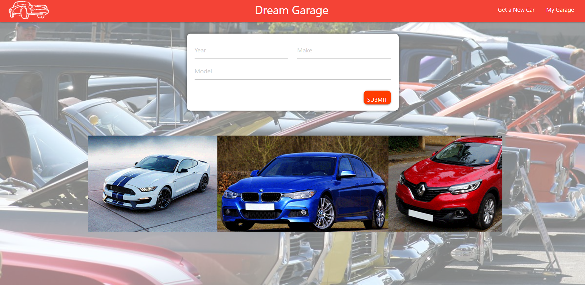
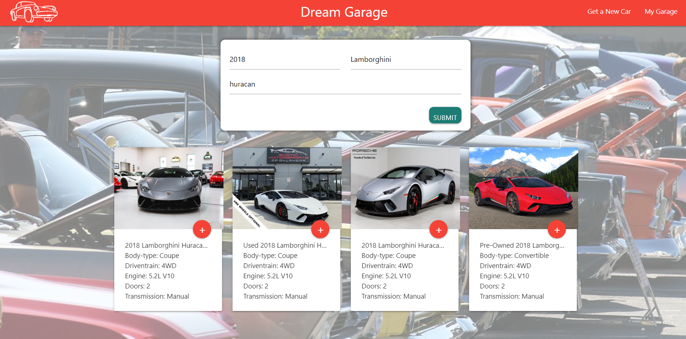
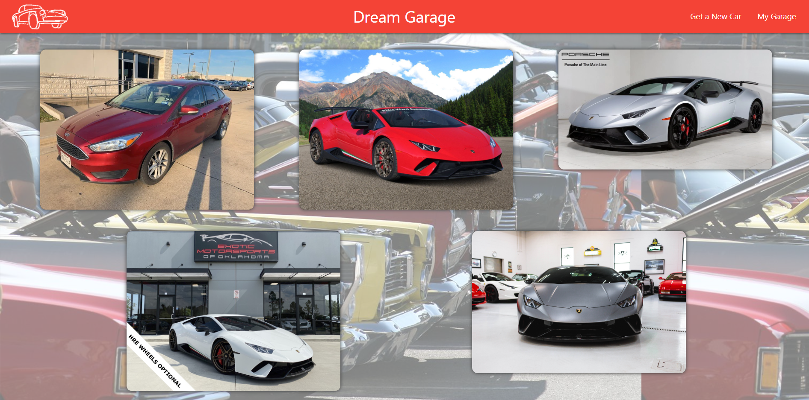
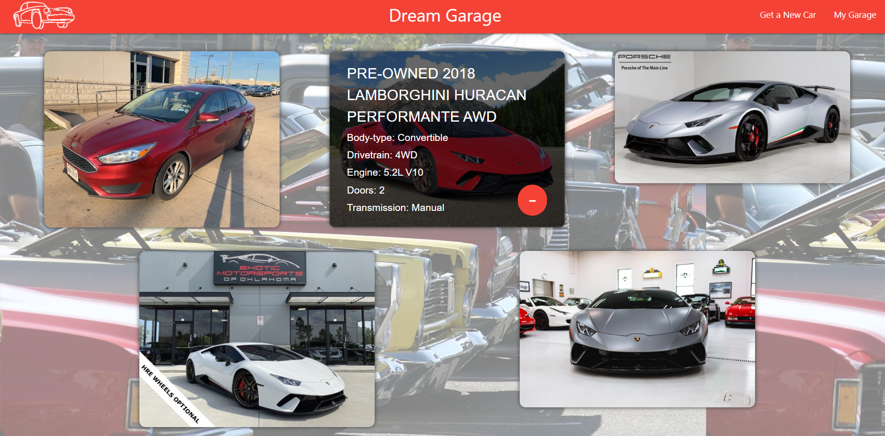

# Project 2

* Design and build your first full-stack web application. You and your team will design and build an app using the MVC paradigm and your own server-side API. You will also continue to add to your professional repertoire with testing, continuous integration and linting tools.

## Description

* For this application, we decided as a team to create an app that would search the for the type of car the user inputs and and show the cars that were currently being sold.

* Due to the api, sometimes we only recieve one or two cars back and that is what shows on the page.

* In the occurance that the api returns empty, we meant to put modals mentioning that the car is not currently up for sale.

* Unfortuanately, we could not get the modals up and working on time.

*  After the search, the user can place the same car multiple times inside of the garage. 

## Usage 

* This application is being run by Heroku : https://limitless-sands-05500.herokuapp.com/

* To run this application localy, the user needs the following packages:
     axios
     express
     express-handlebars
     mysql
     mysql2
     request
     sequelize
     shutterstock-api
     uuid

## Application

* We used a Node and Express server.

* We a Sequelize database and jawsdb on heroku.

* We utilize both GET and POST routes for retrieving and adding new data, as well as delete data.

* We  deployed the application through Heroku.

* We used MarketCheck api as the new api in our website.

* We build this application with the use of Materialize css framework.

* We Setup the files in MVC format. We used this to connect the front end to the back and be able to communicate with both sides.

* We used Handlebars to dynamicaly create the website and set up all of the reuseable code in the main.handlebars. These included the links to the css, js, Materialize, the navbar and footer.

## Screenshots 
* Our application is made up of only two pages, the Home page and the Garage page.

*  This is how the starting page looks when the user first opens the page:

*  This is the same Home page after a search has been done, Here the user can select which cars to send to their garage by clicking the plus icon:

* This screenshot is of the garage were the user can see the cars that have been added to it: 

* Finaly this shows what happens when the user hovers over the car images, and reveals info and a minus icon which deletes the car from the database:

## Future Additions

* We want to be able to get the modals working in the near future to let the user know when the search comes back empty, or something has been misspelled.

* Another thing is that the application as of right now, it does not let the user know that the car has been added to the garage. This is another function that we want to include.

* If this application was going on the production level, we would like to use a paid api which would include every single car that a user can search for.

* To minimalize the ammount of things that the user has to input, upon changing the api we could add dropdowns instead of inputs.

* These dropdowns would include all of the years the api would provide us as well as the car makes and models that we could search for.

* There is a small glitch in the front page carousel, which causes a blank space to briefly appear, we would change that in the future.

* Since it is a garage , a selling and buying function would be a great addition. 

* If we were to add the buying and selling aspects, we would somehow have to add either an ammount of money the user has available to work with and let the user input how much money they want to have available.

## Team Members

* Peter Krumb

* Andre Entrekin

* Jose Castro 